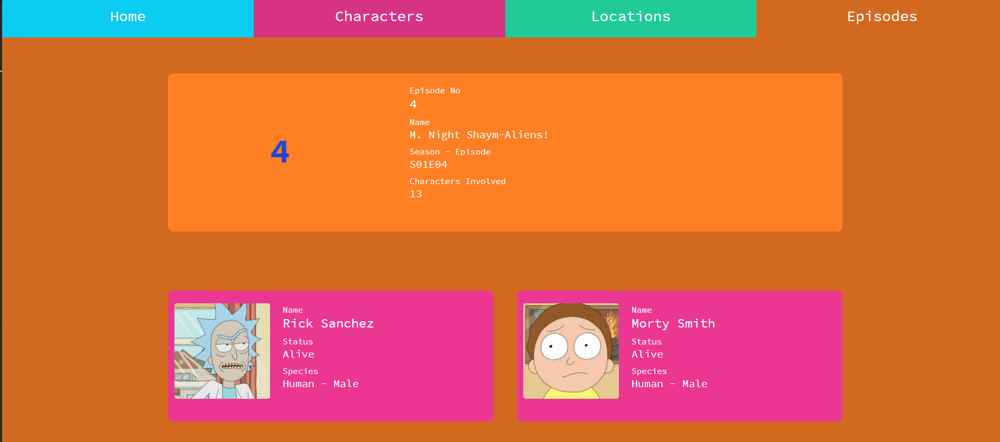

# RickAndMorty

Progress can be viewed at [Rick-and-Morty](https://johnj974.github.io/rick-and-morty/) 14/07/2021

A fictional site which will provide information about the show Rick and Morty

## Technologies Used

This project was generated with:

- [Angular CLI](https://github.com/angular/angular-cli) version 10.1.7.
- [Bootstrap](https://getbootstrap.com/)
- [Typescript](https://www.typescriptlang.org/)
- [Rick & Morty Api](https://rickandmortyapi.com/)
- HTML
- CSS
- [Github](https://github.com/)

## User Experience

## Testing

<!-- The project has been tested on various differant screens to ensure that it is a mobile friendly site. Manual site testing shows that all links are working correctly.

The races section of the site which displays all the races in this calender year has a map which shows track locations around the world, this has worked correctly on testing.

In the results page some of the information is hard to see because of the dynamic team colours and the placement of the data, I chose not to address this as I liked the look and it only affects a small portion of the page, This could be fixed by removing the team colours or just adding the colours to the first element in the table.

Race results have been observed to update between 30 minutes up to one hour of a race finish, The Race calender also updates
whenever there is a change to the racing schedule

On one occasion data was not sent from the Ergast Api, this was fixed with a refresh of the page, I have only witnessed this happen once. -->

## Local Deployment

If you wish to copy the project follow these steps:

- Click on the green Code button above the commit history section
- To clone the repo using http copy the provided address.
- Open a git bash terminal.
- Navigate to a folder which will hold the cloned project.
- Type: git clone `copied address` and press enter.
- Open the project in your editor.
- Run `npm install` to include dependencies.
- Run the development server with `ng serve`.

## Credits

- [Rick & Morty Api](https://rickandmortyapi.com/)

## Further help

To get more help on the Angular CLI use `ng help` or go check out the [Angular CLI README](https://github.com/angular/angular-cli/blob/master/README.md).
